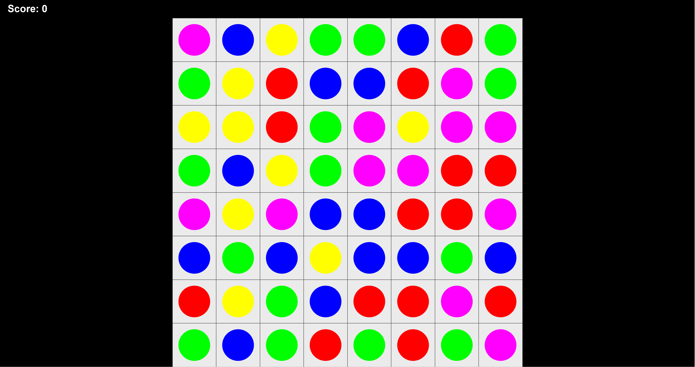

# Match3Game (Java)

A Match-3 puzzle game built in Java with custom game logic and Swing-based UI.

---

## Demo



---

## Status

This project is currently under development.

Core gameplay has been implemented. Additional features such as animations and UI improvements are in progress.

---

## Features

- Match-3 core gameplay (tile swapping and elimination)
- Score tracking system
- Grid-based board logic
- Automatic match detection and clearing
- Runnable desktop version (JAR)

---

## Tech Stack

- Java
- Swing

---

## How to Run

### Run JAR

```bash
java -jar Match3Game.jar